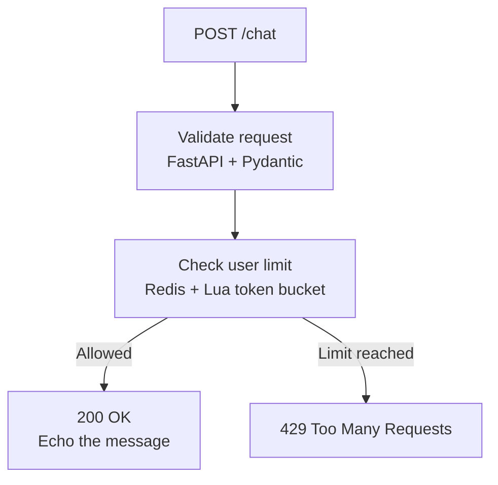
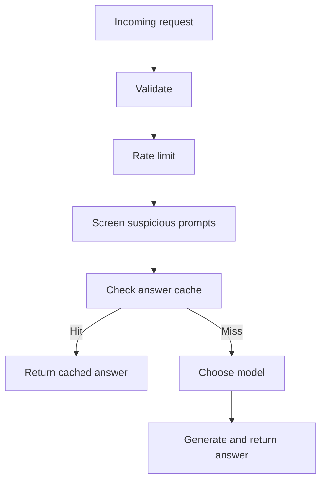

<div align="center">

# Aegis Gateway

### A protective checkpoint for AI applications

Control requests today. Build toward safer, more efficient AI systems tomorrow.


</div>

---

Aegis Gateway is being built to sit between users and AI models. Like a checkpoint at a building entrance, it checks incoming requests before they are allowed through. This helps keep an AI application reliable when usage grows and creates one place to add safeguards, caching, and smarter model selection.

> **What works in v0.1.0:** Request validation and Redis-backed rate limiting. The `/chat` endpoint currently echoes an allowed message; it does **not** call an AI model. Security screening, caching, routing, and observability are planned features, not shipped features.

## Why it matters

| Challenge | How a gateway can help |
|---|---|
| One user sends too many requests | Limit requests per user before they overwhelm the service |
| Requests are missing required data | Reject invalid inputs before processing |
| Repeated AI requests cost money | A future cache can reuse suitable responses |
| Requests vary in difficulty | A future router can select an appropriate model |
| Suspicious prompts reach a model | A future screening step can flag potential attacks |

The first two protections are implemented. The remaining items describe the roadmap.

## Current request flow

The diagram below represents the running v0.1.0 application, not the eventual architecture.



- `/health` reports whether the API process is running.
- `/chat` expects a `user_id` and `message`. Missing fields receive a validation error.
- Each user has a separate bucket with a capacity of 10 requests and a refill rate of 1 token per second.
- Redis runs the token-bucket check and update in one Lua script, so two simultaneous requests cannot spend the same token. The script uses Redis's clock, so every gateway instance agrees on the time.
- When the bucket is empty, the `429` response carries a `Retry-After` header saying how many seconds to wait.
- If Redis is unreachable, `/chat` **fails closed** with `503` within about half a second instead of serving requests unchecked ([ADR-001](docs/adr/0001-token-bucket-in-redis-fail-closed.md)).

## Tools and technologies

| Tool | Role | Status |
|---|---|---|
| Python, FastAPI, Pydantic | API endpoints and request validation | Implemented |
| Redis and Lua scripting | Shared token-bucket rate limiting | Implemented |
| Docker Compose | Runs Redis for local development | Implemented |
| uv | Python environment and dependency management | Implemented |
| pytest and FastAPI TestClient | Basic API tests | Implemented |
| Llama Prompt Guard 2 | Candidate prompt-injection screening model; access and integration still need to be resolved | Planned |
| Redis cache | Exact-match response caching | Planned |
| Local model runtime, such as vLLM, and/or model APIs | Generate answers after checks; provider choice is not final | Planned |
| Rule-based router | Select an appropriate model for a request | Planned |
| Structured logging | Track gateway decisions and errors | Planned |
| OpenTelemetry, Prometheus, Grafana | Deeper tracing, metrics, and dashboards | Future exploration |

## Planned gateway flow

This is the intended direction, not a claim about current functionality.



## Run locally

### Prerequisites

- Python 3.12 or later
- [uv](https://docs.astral.sh/uv/)
- Docker Desktop with its engine running

From a terminal:

```bash
git clone https://github.com/ChingangbamDpakAngom/aegis-gateway.git
cd aegis-gateway
uv sync
docker compose up -d
uv run uvicorn gateway.api.main:app --reload
```

Open the interactive API documentation at:

```text
http://127.0.0.1:8000/docs
```

### Try a request

Use the interactive `/docs` page, or run:

```bash
curl -X POST http://127.0.0.1:8000/chat \
  -H "Content-Type: application/json" \
  -d '{"user_id":"user-123","message":"Hello Aegis"}'
```

While a token is available, the response is:

```json
{"echo":"Hello Aegis","from":"user-123"}
```

When the user's bucket is empty, the API returns HTTP `429`:

```json
{"detail":"Rate limit exceeded"}
```

The health endpoint is available at:

```text
http://127.0.0.1:8000/health
```

## Testing

Start Redis before running the test suite:

```bash
docker compose up -d
uv run pytest -q
```

Tests run against a real Redis, using database 15 (flushed before each test) so they never touch development data. The suite covers validation, bucket exhaustion, `Retry-After`, token refill, separate per-client buckets, and fail-closed behaviour when Redis is down. GitHub Actions runs the same suite on every push, with a Redis service container.

Settings come from environment variables or a local `.env` file: `REDIS_URL`, `REDIS_TIMEOUT_S`, `RATE_LIMIT_CAPACITY`, `RATE_LIMIT_REFILL_PER_S` (see [`config.py`](src/gateway/config.py)).

The Prompt Guard experiment needs PyTorch, which is kept out of the default install: `uv sync --group ml`.

## Project layout

```text
aegis-gateway/
├── src/
│   └── gateway/
│       ├── api/
│       │   ├── __init__.py
│       │   ├── main.py            # FastAPI endpoints
│       │   └── schemas.py         # Request-validation models
│       ├── core/
│       │   ├── __init__.py
│       │   ├── rate_limiter.py    # Redis rate-limit integration
│       │   └── lua/
│       │       └── token_bucket.lua
│       ├── __init__.py
│       ├── config.py              # Settings from environment variables
│       └── py.typed
├── tests/                         # Automated tests (real Redis, DB 15)
├── docs/
│   ├── adr/                       # Architecture Decision Records
│   └── phases/                    # Per-phase design + study notes
├── .github/workflows/ci.yml       # Tests on every push
├── docker-compose.yml             # Local Redis service
├── pyproject.toml                 # Project configuration and dependencies
├── uv.lock                        # Locked dependency versions
├── .gitignore
└── README.md
```

Additional modules will be added as their features are implemented. Experimental scripts are kept separate from the running API and test suite.

## Roadmap

- [x] Validate incoming requests with FastAPI and Pydantic
- [x] Apply per-user rate limiting with Redis and Lua
- [x] Add basic API tests and verify the `429` path manually
- [x] Phase 0: async Redis, env config, fail-closed limiter, deterministic tests, CI ([notes](docs/phases/phase-0.md))
- [ ] Add readiness checking and structured logging
- [ ] Evaluate and integrate prompt-injection screening
- [ ] Add exact-match caching and model routing
- [ ] Connect an AI model and measure latency and cost
- [ ] Explore semantic caching and observability dashboards

## Versioning

`v0.1.0` marks the working validation and rate-limiting foundation. The roadmap is a plan, not a list of released features.
