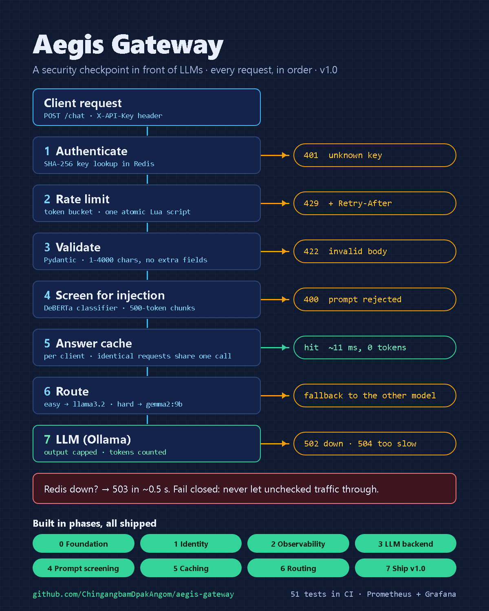
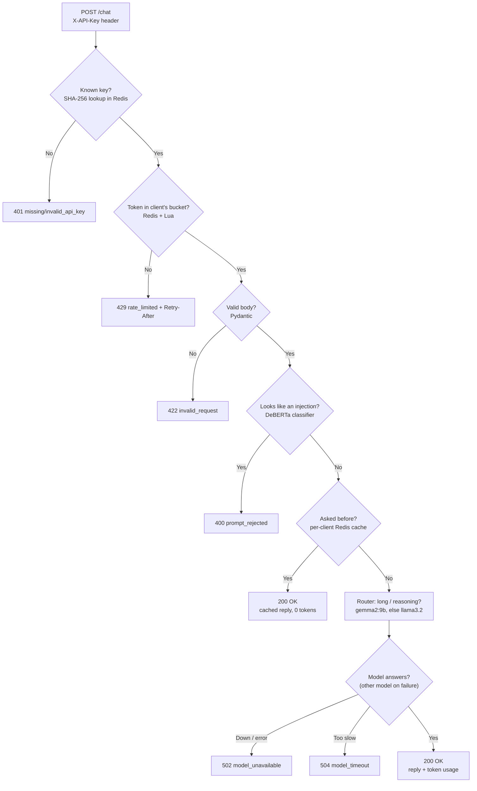
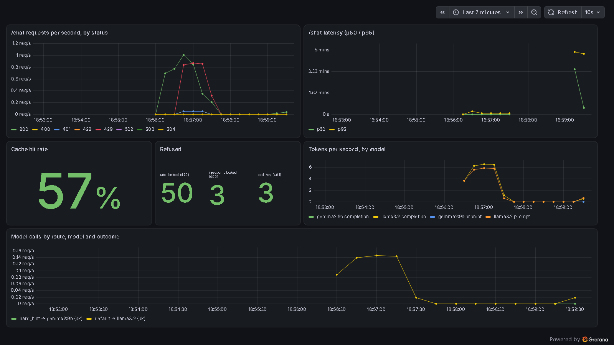

<div align="center">

# Aegis Gateway

### A protective checkpoint for AI applications

Authenticate, rate-limit, screen, cache and route every request before it reaches a model.


</div>

---

Aegis Gateway sits between users and AI models. Like a checkpoint at a building entrance, it checks every request before it is allowed through, which keeps an AI application reliable as usage grows and gives one place for safeguards, caching and model selection.

> **What works now:** API-key authentication, strict request validation, and per-client Redis rate limiting that fails closed, plus request IDs, JSON request logs, Prometheus metrics and a readiness check. Allowed messages are answered by a local model served by [Ollama](https://ollama.com), with token usage reported per request. A rule-based router sends everyday questions to a small fast model (`llama3.2`) and long or reasoning-heavy ones to a larger model (`gemma2:9b`), falling back to the other if one fails. Every message is first screened by a prompt-injection classifier, and repeated questions are answered from a per-client Redis cache in milliseconds.

<p align="center">
  
</p>

## Why it matters

| Challenge | How a gateway can help |
|---|---|
| Anyone can call the service | Require an API key and decide identity server-side |
| One client sends too many requests | Limit requests per client before they overwhelm the service |
| Requests are malformed or oversized | Reject invalid inputs before processing |
| Suspicious prompts reach a model | Screen every message with a prompt-injection classifier first |
| Repeated AI requests cost money | Answer repeats from a per-client cache: ~11 ms and 0 tokens |
| Requests vary in difficulty | Route each message to a small or large model, with fallback |
| Problems go unnoticed | Log every request and expose Prometheus metrics and a Grafana dashboard |

All of these are implemented in v1.0.0.

## Current request flow

The diagram below is the running v1.0.0 application.



- `/health` reports whether the API process is running. `/ready` also checks Redis and returns `503` if this instance can't serve ([ADR-003](docs/adr/0003-observability-logs-metrics.md)).
- Every response carries an `X-Request-ID`, and every request writes one JSON log line (`request_id`, `route`, `status`, `error_code`, `client_id`, `duration_ms`). API keys and messages are never logged.
- `/metrics` exposes Prometheus counters and latency histograms per route.
- `/chat` requires an `X-API-Key` header and a body of exactly `{"message": "..."}` (1–4000 characters; unknown fields are rejected). Identity comes from the key, never from the body ([ADR-002](docs/adr/0002-api-key-identity.md)).
- Keys are stored only as SHA-256 hashes. Each client has its own bucket (default capacity 10, refill 1 token/s), and a key can carry its own limits. Keys of the same client share a bucket, so rotating a key doesn't reset the limit.
- Every error has the same shape: `{"error": {"code": "...", "message": "..."}}`.
- Redis runs the token-bucket check and update in one Lua script, so two simultaneous requests cannot spend the same token. The script uses Redis's clock, so every gateway instance agrees on the time.
- When the bucket is empty, the `429` response carries a `Retry-After` header saying how many seconds to wait.
- Only requests that pass every check reach the model, so a rejected request costs no inference. Answers are capped at `MAX_OUTPUT_TOKENS` (512). If Ollama is down the gateway returns `502`, and if it's too slow, `504` ([ADR-004](docs/adr/0004-model-backend-ollama.md)).
- Messages of 1000+ characters, or containing phrases like "step by step", "compare", "debug" or a code block, go to `LARGE_MODEL`. Everything else goes to `MODEL`. If the chosen model errors or times out, the other one answers, and the response and log say so (`route`, `model`, `fallback`). On a laptop, `llama3.2` answers in ~2 s and `gemma2:9b` in ~60 s, so the large model gets its own 180 s timeout ([ADR-007](docs/adr/0007-model-router.md)).
- Before the model, each message is scored by a prompt-injection classifier (`protectai/deberta-v3-base-prompt-injection-v2`, swappable for Llama Prompt Guard 2). Scores at or above `GUARD_THRESHOLD` (0.5) are refused with `400 prompt_rejected`. Long messages are scored in 500-token chunks, so an attack can't hide past the classifier's window. On a public benchmark it made **no false positives but caught only 37% of injections**, so it's a tripwire, not a complete defence ([ADR-005](docs/adr/0005-prompt-injection-guard.md)).
- Answers are cached in Redis for `CACHE_TTL_S` (1 hour), **per client**, so one client's answers never reach another. A repeat of the same question (ignoring whitespace) returns in ~11 ms instead of ~2–11 s and costs 0 tokens. The response says `"cache": "exact"`, `"miss"` or `"coalesced"`: identical questions arriving together share one model call instead of each making their own. A semantic cache (similar meaning, via embeddings and Redis 8 vector sets) is built but **off by default**, because the evaluation showed it returns wrong answers: "10 kilometres to miles" got the cached "10 miles to kilometres" answer ([ADR-006](docs/adr/0006-answer-cache.md)).
- Prompt and completion tokens are returned in `usage`, written to the log line, and counted in `aegis_llm_tokens_total`.
- If Redis is unreachable, `/chat` **fails closed** with `503` within about half a second instead of serving requests unchecked ([ADR-001](docs/adr/0001-token-bucket-in-redis-fail-closed.md)).

## Tools and technologies

| Tool | Role | Status |
|---|---|---|
| Python, FastAPI, Pydantic | API endpoints and request validation | Implemented |
| Redis and Lua scripting | Shared token-bucket rate limiting | Implemented |
| Docker and Docker Compose | Gateway image (non-root) and a one-command stack: gateway, Redis, Prometheus, Grafana | Implemented |
| uv | Python environment and dependency management | Implemented |
| pytest and FastAPI TestClient | API, failure-mode and optional live-model tests | Implemented |
| Hugging Face Transformers + DeBERTa-v3 injection classifier | Screens every prompt before the model; `scripts/eval_guard.py` measures it | Implemented |
| Llama Prompt Guard 2 | Drop-in alternative classifier (gated on Hugging Face; set `GUARD_MODEL`) | Supported, not default |
| Redis cache | Per-client exact-match answer cache with TTL | Implemented |
| Redis 8 vector sets + Ollama embeddings (`all-minilm`) | Optional semantic cache; `scripts/eval_semantic_cache.py` picks the threshold | Implemented, off by default |
| Ollama (`llama3.2`) + httpx2 | Local model that answers `/chat` after all checks pass | Implemented |
| Rule-based router with fallback | Picks `llama3.2` or `gemma2:9b` per message; the other is the fallback | Implemented |
| Hosted model APIs or vLLM | Further backends the router could use | Future exploration |
| Structured logging (stdlib `logging`, JSON) | One log line per request with request ID and decision | Implemented |
| Prometheus client | Request counters and latency histograms at `/metrics` | Implemented |
| Prometheus + Grafana | Scraping and a provisioned dashboard (`ops/`) | Implemented |
| OpenTelemetry | Distributed tracing across gateway and model | Future exploration |

## Performance

Load-tested with [`scripts/load_test.py`](scripts/load_test.py) against the full Docker stack. Setup: laptop (RTX 3050, 4 GB), Docker Desktop on Windows, one uvicorn worker, prompt guard off, Ollama on the host.

| Scenario | Requests | Concurrency | Throughput | p50 | p95 | p99 | Result |
|---|---|---|---|---|---|---|---|
| **cached**: same question every time (gateway overhead only) | 2000 | 20 | 246 req/s | 73 ms | 109 ms | 151 ms | all `200` |
| **ratelimit**: one key with 10 tokens, +1/s | 200 | 20 | 61 req/s | 52 ms | 3.1 s | 3.2 s | 11 × `200`, 189 × `429`; **1** model call, 10 shared |
| **model**: a new question every time | 12 | 4 | 0.9 req/s | 3.0 s | 6.7 s | 7.0 s | all `200` |

The load test found a real bug. Before [request coalescing](docs/adr/0008-packaging-and-load-testing.md), the 11 allowed requests in the *ratelimit* run all missed the cache at once and queued 11 model calls, giving a p95 of 12.4 s. Now identical requests in flight share one call. The *model* row is bounded by the laptop GPU, not by the gateway.

### Dashboard

`docker compose --profile stack up` starts Prometheus and a provisioned Grafana dashboard at http://localhost:3000. This screenshot is from a mixed-traffic run with the guard on:

<p align="center">
  
</p>

## Deploy

The gateway talks to any OpenAI-compatible model API, so the same image runs locally against Ollama or in the cloud against a hosted API. [docs/deploy.md](docs/deploy.md) walks through a free public demo: Hugging Face Spaces (gateway), Upstash (Redis) and Groq (model), redeployed automatically on every push to `master`.

## Run locally

### Prerequisites

- Python 3.12 or later
- [uv](https://docs.astral.sh/uv/)
- Docker Desktop with its engine running
- [Ollama](https://ollama.com/download) with the models pulled: `ollama pull llama3.2` (required) and `ollama pull gemma2:9b` (the large model; without it, hard questions fall back to `llama3.2`)

**Everything in Docker** (gateway, Redis, Prometheus, Grafana; Ollama stays on the host for the GPU):

```bash
git clone https://github.com/ChingangbamDpakAngom/aegis-gateway.git
cd aegis-gateway
docker compose --profile stack up -d --build                   # add WITH_GUARD=true for the prompt guard (image 372 MB -> 3 GB)
docker compose exec gateway python -m gateway.keys my-app      # prints your API key
```

The API is at http://localhost:8000/docs, Prometheus at http://localhost:9090, Grafana at http://localhost:3000.

**For development** (gateway on your machine, Redis in Docker):

```bash
uv sync --group ml     # includes PyTorch for the prompt guard; or set GUARD_ENABLED=false and use `uv sync`
docker compose up -d
uv run uvicorn gateway.api.main:app --reload
```

Open the interactive API documentation at:

```text
http://127.0.0.1:8000/docs
```

### Create an API key

```bash
uv run python -m gateway.keys my-app                 # default limits
uv run python -m gateway.keys my-app --capacity 5 --refill-per-s 0.5
```

The key (`aeg_...`) is printed **once**. Only its hash is stored.

### Try a request

In the `/docs` page click **Authorize** and paste the key, or run:

```bash
curl -X POST http://127.0.0.1:8000/chat \
  -H "X-API-Key: aeg_your_key_here" \
  -H "Content-Type: application/json" \
  -d '{"message":"Hello Aegis"}'
```

While a token is available, the response is:

```json
{"reply":"Hello! How can I help?","model":"llama3.2","usage":{"prompt_tokens":28,"completion_tokens":8},"client_id":"my-app"}
```

When the client's bucket is empty, the API returns HTTP `429` with a `Retry-After` header:

```json
{"error":{"code":"rate_limited","message":"Rate limit exceeded"}}
```

The health endpoint is available at:

```text
http://127.0.0.1:8000/health
```

## Testing

Start Redis before running the test suite:

```bash
docker compose up -d
uv run pytest -q
```

Tests use a fake Ollama (`httpx2.MockTransport`), so neither CI nor you need a model to run them. The prompt guard is replaced by a fake scorer the same way, so tests need no PyTorch. To also hit the real models, run `AEGIS_LIVE_MODEL=1 AEGIS_LIVE_GUARD=1 uv run pytest -q -k live` with Ollama running and the `ml` group installed.

Tests run against a real Redis, using database 15 (flushed before each test) so they never touch development data. The suite covers API-key authentication (missing, unknown, stored hashed), request validation (empty, oversized, unknown fields), the uniform error format, bucket exhaustion, `Retry-After`, token refill, separate per-client buckets, key rotation sharing a bucket, fail-closed behaviour when Redis is down, `/ready` vs `/health`, request-ID handling, the JSON log line, metric labels, the exact request sent to the model, 502/504 on model failures, token accounting, that rate-limited requests never reach the model, prompt-injection refusals (before any inference), the configurable threshold, chunked screening of long messages, exact cache hits (0 tokens, whitespace-insensitive), per-client cache isolation, cache TTL, and the semantic cache's paraphrase hits, threshold and graceful degradation when the embedding model fails, the routing rules, per-model timeouts, fallback on error and on timeout, 502 when every model fails, and request coalescing. GitHub Actions runs the same suite on every push, with a Redis service container, and also builds the Docker image.

Settings come from environment variables or a local `.env` file: `REDIS_URL`, `REDIS_TIMEOUT_S`, `RATE_LIMIT_CAPACITY`, `RATE_LIMIT_REFILL_PER_S` (defaults for keys without their own limits), `MAX_MESSAGE_CHARS`, `METRICS_ENABLED`, `LLM_BASE_URL` (any OpenAI-compatible API; default local Ollama), `LLM_API_KEY`, `MODEL`, `MODEL_TIMEOUT_S`, `MAX_OUTPUT_TOKENS`, `GUARD_ENABLED`, `GUARD_MODEL`, `GUARD_THRESHOLD`, `CACHE_ENABLED`, `CACHE_TTL_S`, `SEMANTIC_CACHE`, `EMBED_MODEL`, `SIMILARITY_THRESHOLD`, `LARGE_MODEL`, `LARGE_MODEL_TIMEOUT_S`, `ROUTE_LONG_CHARS` (see [`config.py`](src/gateway/config.py)).

PyTorch and Transformers (for prompt screening) are kept in the optional `ml` group: `uv sync --group ml`. Measure the guard with `uv run --group ml python scripts/eval_guard.py [model]`.

## Project layout

```text
aegis-gateway/
├── src/
│   └── gateway/
│       ├── api/
│       │   ├── __init__.py
│       │   ├── main.py            # FastAPI endpoints
│       │   └── schemas.py         # Request-validation models
│       ├── core/
│       │   ├── __init__.py
│       │   ├── cache.py           # Per-client answer cache (exact + optional semantic)
│       │   ├── guard.py           # Prompt-injection classifier (chunked scoring)
│       │   ├── llm.py             # Model backend call (Ollama) + token metrics
│       │   ├── rate_limiter.py    # Redis rate-limit integration
│       │   ├── router.py          # Rule-based model choice + fallback
│       │   └── lua/
│       │       └── token_bucket.lua
│       ├── __init__.py
│       ├── config.py              # Settings from environment variables
│       ├── keys.py                # API-key creation CLI + hashing
│       ├── observability.py       # Request IDs, JSON logs, Prometheus metrics
│       └── py.typed
├── scripts/
│   ├── eval_guard.py              # Precision/recall/latency of the guard on a public dataset
│   ├── eval_semantic_cache.py     # Chooses (or rejects) a semantic-cache threshold
│   └── load_test.py               # Throughput / latency under concurrent load
├── tests/                         # Automated tests (real Redis, DB 15)
├── docs/
│   ├── adr/                       # Architecture Decision Records
│   └── phases/                    # Per-phase design + study notes
├── .github/workflows/ci.yml       # Tests on every push
├── ops/                           # Prometheus config + Grafana datasource and dashboard
├── Dockerfile                     # Gateway image (optional CPU-only guard)
├── docker-compose.yml             # Redis; `--profile stack` adds gateway, Prometheus, Grafana
├── pyproject.toml                 # Project configuration and dependencies
├── uv.lock                        # Locked dependency versions
├── .gitignore
└── README.md
```


## Roadmap

- [x] Validate incoming requests with FastAPI and Pydantic
- [x] Apply per-client rate limiting with Redis and Lua
- [x] Add basic API tests and verify the `429` path manually
- [x] Phase 0: async Redis, env config, fail-closed limiter, deterministic tests, CI ([notes](docs/phases/phase-0.md))
- [x] Phase 1: hashed API keys, per-client limits, strict request contract, uniform errors ([notes](docs/phases/phase-1.md))
- [x] Phase 2: readiness check, request IDs, structured logging, Prometheus metrics ([notes](docs/phases/phase-2.md))
- [x] Phase 3: answer `/chat` with a local model (Ollama), output cap, 502/504 handling, token accounting ([notes](docs/phases/phase-3.md))
- [x] Phase 4: prompt-injection screening before the model, evaluated on a public dataset ([notes](docs/phases/phase-4.md))
- [x] Phase 5: per-client answer cache; semantic cache evaluated and kept opt-in ([notes](docs/phases/phase-5.md))
- [x] Phase 6: rule-based model router with per-model timeouts and fallback ([notes](docs/phases/phase-6.md))
- [x] Phase 7 (v1.0): Docker image, one-command compose stack, load test (and a request-coalescing fix it prompted), Grafana dashboard ([notes](docs/phases/phase-7.md))

## Versioning

`v0.1.0` marked the validation and rate-limiting foundation. **`v1.0.0`** is the complete gateway: identity, rate limits, observability, a local LLM, prompt screening, caching, routing with fallback, and a load-tested Docker stack. Next ideas (not promises): OpenTelemetry tracing, token-based budgets per client, streaming responses, a learned router.
